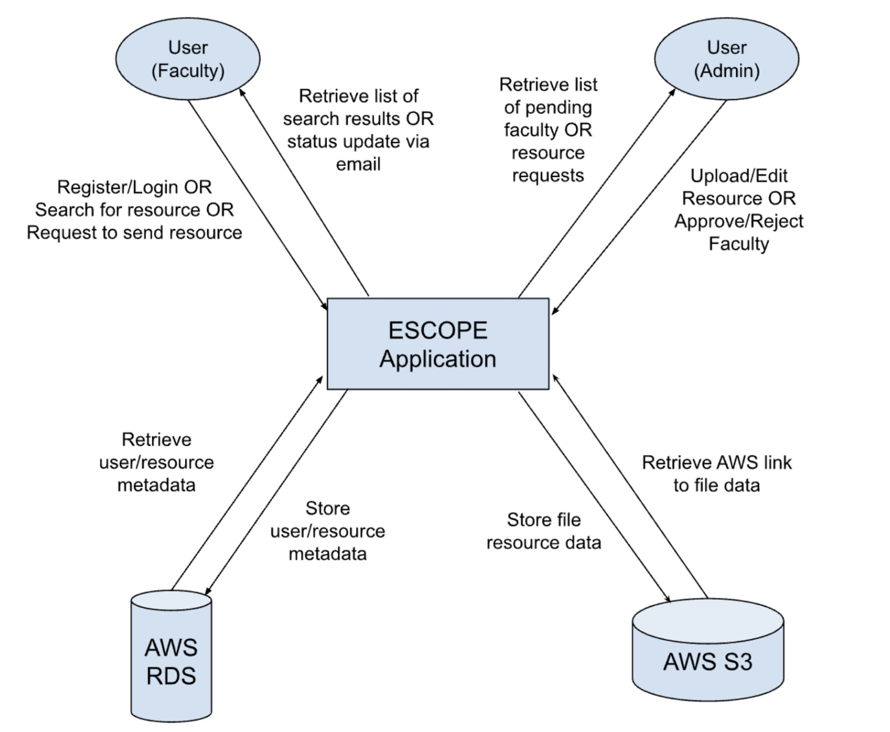

# Contributing

This is for contributors maintaining the project.

**NOTE** 

As stated in the [README.md](./README.md) file, credentials are required to access all of the services used by this project. Please contact Shane Brown or any of the previous developers for access to these credentials in order to make changes to the live website. 

## Content

<ol>
  <li><a href="#overview"> Architecture Overview </a></li>
  <li> <a href="#nextjs"> Next.js </a> </li>
  <li> <a href="#server-actions"> Server actions </a> </li>
  <li> <a href="#mantine"> Mantinue UI </a></li>
  <li><a href="#mysql"> MySQL </a></li>
  <li><a href="#next-auth"> Next.auth </a></li>
  <li><a href="#features"> Features Implemented </a></li>
  <li><a href="#future"> Known Issues and Future Enhancements </a></li>  
</ol>

## <span id="overview"> Architecture Overview </span>



**Figure 1.** Application interaction flow between end users and backend infrastructure.

## <span id="nextjs"> Next.js </span>

The project is currently on <a href="https://nextjs.org/blog/next-14">version</a> `14.0.2`.

## <span id="server-actions"> Server Actions </span>

The project uses server actions for fetching, mutating, and creating data, essentially acting as our API.

All these actions can be found in the [actions](./engr-site/actions/) directory (Please see files for documentation).

Server actions are sorted by their functionality. (e.g. any auth server action are in `./engr-site/actions/auth`).

Our server actions return an object of success and/or failure.

We are currently working on making the return structure more consistent and more conventional.

As of right now, the response either returns

```bash
{
  success: data
}
```

or

```bash
{
  failure: ""
}
```

or

```bash
{
  success?: data
  failure?: ""
}
```

We are working on a more clear approach:

### Success response

```
{
  success: true
  data?: Data
}
```

### Failure response

```
{
  success: false
  error: "Error message"
}
```

## <span id="mantine"> Mantine UI </span>

The project uses Mantine v7 for UI components. Mantine is a React component library that provides a set of accessible and customizable UI elements.

All Mantine UI components are located in the components directory. Components pulled [Mantine UI](https://ui.mantine.dev/) are located in the  ```mantine``` folder.
Custom components that may also use Mantine objects are loated in the ```custom``` folder.

We use Mantine's built-in theming capabilities to ensure a consistent look and feel across the application. The theme configuration can be found in ```/app/layout.tsx```.

## <span id="mysql"> MySQL </span>

Files related to the database can be found in the [database](./engr-site/database) directory.

### Connecting to database in terminal

Run this in terminal to connect to database cluster

```bash
mysql -h [HOST] -u admin -p
```

Enter the password (DB_PASSWORD).

Once you are in, enter `use DB_NAME` to switch to that database.

You can now call queries to the database and get results in the terminal.

### Database schema

The file [MASTER.sql](./engr-site/database/MASTER.sql) contains all the tables for our database (appended with ```_v3```)

**NOTE**: All relevant data objects and their type conventions can be found in the [types_v2](./engr-site/utils/types_v2.ts) file.

### Database connector

The db connector can be found in the [dbConnector.ts](./engr-site/database/dbConnector.ts) file.

### Executing queries

There's a function called `dbConnect(query: string, values?: any[])` in [dbConnector.ts](./engr-site/database/dbConnector.ts) that is used to execute all the queries in our project.

The parameter `query` is the query that you want executed.

The parameter `values` is the values needed for the query if there are any `?` in the expected query.

### Queries

The queries that are executed in our project are declared in the files (server action files or helper files) that they will be used in.

### Helper functions

There are helper functions that we have for common queries like finding a user by Id or Email, etc.

These functions are in all the files in the [data](./engr-site/database/data) directory.

The file name is what the helper functions are for.

## <span id="next-auth"> Next.auth </span>

The projects is on <a href="https://authjs.dev/getting-started/migrating-to-v5"> version</a> `5.0.0-beta.5`.

These are the files that are important for the setup:

[auth.config.ts](./engr-site/auth.config.ts)

[auth.ts](./engr-site/auth.ts)

[routes.ts](./engr-site/routes.ts)

[[...nextauth]/route.ts](./engr-site/app/api/auth/[...nextauth]/route.ts)

### Helper functions and custom hooks

The file [authHelpers.ts](./engr-site/utils/authHelpers.ts) has helper functions for getting the currently logged in user and their role. These are async functions used for server pages and components.

The files [useCurrentRole.ts](./engr-site/hooks/useCurrentRole.ts) and [useCurrentUser.ts](./engr-site/hooks/useCurrentUser.ts) do the same thing but for client pages and components.

### Protected pages

All protected pages calls either [requireAuth()](./engr-site/actions/auth/requireAuth.ts) (for server or async entities) or [useRequireAuth()](./engr-site/hooks/useRequireAuth.ts) (for client entities) to verify the user is authorized.
The user will be redirected to `/auth/login` if they're not authorized.

### For the future: Middleware

Currently, we are calling functions on every protected page to check if the user is authenticated. A better solution would be to implement a middleware.

We have the middleware functionality in a file called [middleware.txt](./engr-site/middleware.txt).

The middleware was working in local development but was breaking in production due to **"Edge compatibility"** since there is a **"Node.js api"** used in the middleware.

We haven't been able to find a fix, maybe there's a bug in our code, or it'll work in the future with updates. But to test out the middleware, change `middleware.txt` to `middleware.ts`.

Here are some resources about the issue with **the edge**:

<ul>
<li><a href="https://authjs.dev/guides/edge-compatibility#middleware">Edge Compatibility </a> </li>
</ul>

## <span id="features"> Features Implemented </span>

Below are the main project requirements that have been successfully implemented:

### Core Functionality
- **Advanced Search System**
  - Keyword search bar (searches resource (file/link) metadata)
  - Multi-filter capability:
    - By content type: Exercises | Notes | Interactive | Video
    - By material type: File | Link
    - By taxonomy: Tags | Courses | Course Topics
    - By contributor
  - Hierarchical navigation:
    - Navbar browse path: Courses → Course Topics → Resources

### User Management
- **Role-Based Access Control**
  - Roles: Admin | Instructor
  - Account statuses: Pending | Approved | Activated | Rejected
- **Authentication**
  - NextAuth.js implementation: Sign In | Sign Out | Register | Change Password
  - Email verification
  - Session management

### Content Management
- **Course Organization**
  - Course → Course Topic (hierarchy)
  - AWS RDS for metadata storage
- **Resource Uploads**
  - File uploads to AWS S3
  - Link submissions to AWS RDS
  - Tag resources during upload

### Community Features
- **Ratings & Reviews**
  - 5-star rating system
  - User reviews thread per resource
- **Request to Share Resources**
  - External Request Form to share resources

### Administrative Tools
- **Admin Dashboard**
  - Upload Resources: File | Link
  - Add Content: Courses | Course Topics
  - Approve/Reject User Registration Requests
  - Approve/Reject External Resource Requests 

### Technical Infrastructure
- **Cloud Services**
  - AWS S3 for file storage
  - AWS RDS for database
- **Responsive UI**
  - Mantine component library

## <span id="future"> Known Issues and Future Enhancements </span>

### Known Issues
- **Dashboard Button Rendering**  
  The Dashboard button in the Navbar occasionally fails to render correctly based on the logged-in user's role, often requiring a page refresh to display properly.

### Future Enhancements

#### Technical Improvements
- **Automated Testing Pipeline**  
  Implement CI/CD with Jest, Cypress, or Playwright for end-to-end testing.
- **Tech Stack Updates**  
  Upgrade core dependencies (React, Next.js, TypeScript) to their latest stable versions.
- **Security Audit**  
  Conduct regular vulnerability scans and implement security best practices.

#### Feature Additions
- **Admin Creation**
  Add a feature that allows admins to create other admins. Currently, admins can only be created by manually changing the user's role in the ```Users_v3``` database table.
- **File Type Support**  
  Expand supported resource upload formats beyond PDFs (e.g., DOCX, PPT, images).
- **UI/UX Polish**  
  - Improve responsive design for all screen sizes . 
  - Refine visual consistency and accessibility.

#### Testing & Quality
- **Usability Testing**  
  Conduct user testing sessions to identify pain points.
- **Edge Case Testing**  
  Expand test coverage for uncommon but critical scenarios.